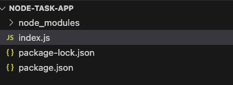

# **Node JS Express for FrontEnd Developers Part One: Getting Starting**

Node.js uses Chrome’s V8 Javascript engine to provide a cross-platform development platform. In other words, it takes Javascript out of the browser and lets you run it anywhere. This makes it especially attractive for web developers because Node lets you use a single language and development tools for backend and frontend applications. 

In this series, we will use Node with the Express framework to provide a backend for [React](https://github.com/trider/react-task-tutorial) and [Angular](https://github.com/trider/ng-task-tutorial) task management web applications. We will also cover querying and persisting data with [MongoDB](https://www.mongodb.com/), using [Swagger](https://yyu3nikvu1.execute-api.us-east-1.amazonaws.com/api-docs/) to provide online documentation, and deploying a [serverless](https://app.serverless.com/) version of the application.

In this first part, we will install our development environment, create an index.js file, and write the initial application code. Please note that Node.js supports both regular Javascript and TypeScript. For the sake of simplicity, I have written the examples using Javascript. In addition, all examples are written using arrow notation, in line with current conventions, instead of function calls.

## **Getting Started**

Before we can build a Node application, we need to install Node.js. How you install Node, depends on your development platform and your preferred package manager. The good news is that the [Download](https://nodejs.org/en/download/package-manager) page on the Node website covers all the available ways to download and install Node. Once you have Node installed, open a Terminal window and create a new folder.

```bash
mkdir node-task-app
```

Next, open the folder

```bash
cd node-task-app  
```

Now, we create the app using this command

```bash
npm init
```

Follow the commands, and at the end type: Yes.

```bash
Use \`npm install \<pkg\>\` afterwards to install a package and  
save it as a dependency in the package.json file.  
Press ^C at any time to quit.  
package name: (task-app) node-task-app  
version: (1.0.0)   
description: Node task app  
entry point: (index.js)   
test command:   
git repository:   
keywords:   
author:   
license: (ISC)   
About to write to /Users/jonathangold/Code/MVDS/node/node-task-app/package.json:  
{  
  "name": "node-task-app",  
  "version": "1.0.0",  
  "description": "Node task app",  
  "main": "index.js",  
  "scripts": {  
    "test": "echo \\"Error: no test specified\\" && exit 1"  
  },  
  "author": "",  
  "license": "ISC"  
}  
Is this OK? (yes) yes
```

Next, open your application folder in your IDE/editor, such as Visual Studio Code. In the IDE, open the terminal and type:

```bash
npm install
```

As a final step, we install the Express framework.

```bash
npm install express
```

## **Creating an Entrypoint**

With the basic pieces in place, we can create an entry point to our application. As the name suggests, this page serves as the gateway to our server application. To create the entry point, create a file called index.js.



In your editor, open index.js. Add a reference to the Express framework:

```javascript
const express = require('express');
```

Now, we create our web application by declaring the app variable and instantiating the Express framework.

```javascript
const app = express();
```

At the bottom of the file, we add a listener. This listens for requests on the specified port. In our example, we specified port 3000\. In the function, we add a line that logs a message when the app is run.

```javascript
app.listen(3000, () => {
  console.log('Server is running on port 3000');
})
```

Launch the app by opening the application folder in the terminal and typing.

```bass
node index.js
```

The terminal displays the text in the message.

## **Adding a Route**

So far, our app doesn’t do very much. If we type the address [http://localhost:3000](http://localhost:3000), the browser displays a blank page. To display a message, we need to create a route. In front-end development, routes provide the address of a specific page. Each route is a URL that navigates directly to that page. In our case, we are building a REST API. So, each route will either return data or perform an action. To demonstrate, let's add a route that displays a message when we open  [http://localhost:3000](http://localhost:3000). In the middle of the app, add:

```javascript
app.get('/', (req, res) => {
 res.send('Welcome to the Task API');
});
```

Here we define the default route. This route receives an HTTP Get command, and returns a short message.  The command has two parameters req and res. The req parameter is an object used to pass parameters, and we will look at it in more details in the next installment. The res parameter is an object used to return a response. In our case, we use the res.send method to return a short string. If you restart the app and refresh your browser, you will see a message.

## **Conclusion and Next Installment**

In this part, we tool our first steps build a REST API with Node.js and Express. We installed Node and configured our development environment. Next, we created an index.js file and created the foundations of our API. The last step was to create a route that displays a message when calling the API. In the next installment, we will build on this foundation and dive deeper into routing.

