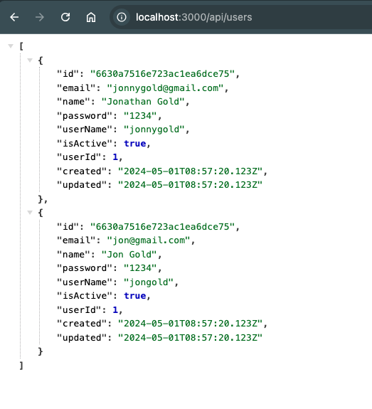
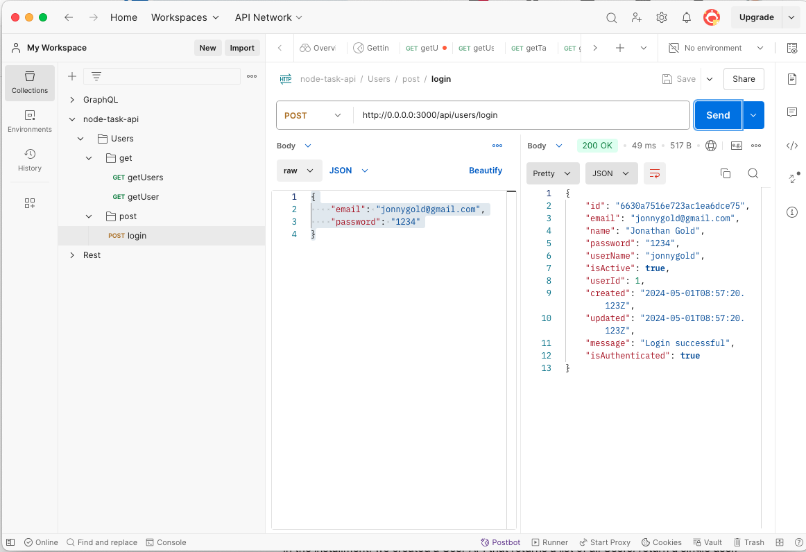

# **Node JS Express for FrontEnd Developers Part Two: Building an API**

In the first part of this [series](https://www.linkedin.com/pulse/node-js-express-frontend-developers-part-one-getting-starting-gold-funaf/?trackingId=ZjQG%2FLnURF2aohu4XE2YPA%3D%3D), we took our first steps to build a REST API with Node.js and Express. We installed Node and configured our development environment. Next, we created an index.js file and created the foundations of our API. The last step was to create a route that displays a message when calling the API.

```javascript
const express = require('express');  
const app = express();

app.get('/', (req, res) => {  
 res.send('Welcome to the Task API');  
});

app.listen(3000, () => {  
 console.log('Server is running on port 3000');  
})
```

In this installment, we will build on this foundation. Specifically, we will add middleware to our application, add parameterized URL endpoints, return JSON responses, and work with HTTP post commands.

The sample code and files for this installment can be downloaded from [GitHub](https://github.com/trider/node-task-api-tutorial/tree/main/node-task-api-part-02).

## **Adding Middleware**

In Part One, we mentioned that each app method has a path and two parameters req(request) and res(response). Node.js [middleware](https://www.turing.com/kb/building-middleware-for-node-js) provides a way to intercept req and res objects and modify them. We define middleware with the app.use() method. For example, we can use the following to show us the HTTP method and URL with the following middleware:

```javascript
const express = require('express');  
const app = express();  
app.use((req, res, next) => {  
 console.log(Method:${req.method}, Path:${req.url});  
 next();  
});
```

When we refresh the default page, the following is displayed

Server is running on port 3000

```javascript
GET /
```

## **Building a User API**

A REST API is a collection of endpoints (URLs) that return or modify data from a server. Currently, our app only provides a default URL. One of the first things we might want a task management application to do is to provide a list of application users. For example, this endpoint returns a list of all users:

/api/users

The endpoint returns the list as a JSON array. To provide support for JSON, we need to install the bodyParser middleware. This will enable our application to read JSON payloads and return JSON responses.

**npm install** \--save body-parser

Next, we add a reference and declare the middleware.

```javascript
const app = express();

const bodyParser = require('body-parser');  
app.use(bodyParser.json());
```

## **Referencing Data Files**

Our User API needs a list of users to query and authenticate. At this stage, all data will be retrieved from files. Create a folder called data. In the folder, create a file called users.js. You can download [users.js](https://github.com/trider/node-task-api-tutorial/blob/main/node-task-api-part-02/data/users.js) from the project’s GitHub repo.



Declare a users variable that references users.js.

```javascript
const users = require('./data/users');
```

## **Creating an Endpoint**

An endpoint is a URL that lets us access API commands. As previously mentioned, our first endpoint will return a list of all users as a JSON object. JavaScript Object Notation or [JSON](https://www.json.org/json-en.html), is a simple standard data format. The body-parser middleware we installed provides the necessary support to process JSON data and return JSON responses. We create the /api/users endpoint by adding this code.

```javascript
app.get('/api/users', (req, res) => {  
 res.json(users);  
});
```

The res object’s (responses) json method consumes our list of users and returns an array of JSON objects.

## **Redirecting Endpoints**

When we open the API’s default route, we see a welcome message message. Instead, the user will be redirected to /api/users.

```javascript
app.get('/', (req, res) => {  
 res.send('Welcome to the Task API');  
});
```

We can do this by replacing the res object’s send method with a redirect method.

```javascript
app.get('/', (req, res) => {  
 res.redirect('/api/users');  
});
```

When you open the browser to [http://localhost:3000](http://localhost:3000), you are redirected to:
****
## **Querying Data with Parameterized Endpoints**

Our first endpoint returned all users, but what if we only need a specific user’s profile? We can extend our existing endpoint with a username parameter.

```bash
/api/users/jonnygold
```

Parameters are indicated by adding /: followed by a name.

```bash
/api/users/:user
```

The parameter is accessed from the request (req) object’s params attribute. In this case, we access the user parameter with req.params.user. We implement the endpoint with the following code. The code locates the profile that matches the user name.

```javascript
app.get('/api/users/:user', (req, res) => {  
 res.json(users.find(user => user.userName === req.params.user));   
});
```

## **Sending and Processing Request Payloads**

Parameterized URLs are useful for a wide range of uses, but they have a number of limitations. For a start, as the number of parameters increases they become longer and more complex. If you want to add special characters, such as punctuation or control characters, they must be prefaced with escape characters. From a privacy and security perspective, they are problematic. This is because all the parameters are readable within the URL and are easy for any entity to read and capture. In these cases, it is best to send the request data as an object (payload).

An ideal use for sending request payloads is to create a login endpoint. For example, to login we want to send an object that contains the user’s credentials. Note for the sake of simplicity, the user’s password is not encrypted.

```json
{  
    "email": "jonnygold@gmail.com",  
    "password": "1234"  
}  
```

Until now, we have created endpoints that use HTTP Get commands. To send a payload, we use HTTP post. You access the payload from the req object’s body attribute. You can use the following to retrieve the payload’s email:

req.body.email

We process the payload and send the appropriate response by adding this endpoint:

```javascript
app.post('/api/users/login', (req, res) => {

 if(users.find(user => user.email === req.body.email &&   
   user.password ===  req.body.password)){  
    res.json({  
      ...users.find(user =>   
      user.email === req.body.email &&   
      user.password === req.body.password),  
      message: 'Login successful',  
      isAuthenticated: true  
    });  
  }  
  else{  
   res.json({  
    message: 'Login failed',   
    isAuthenticated: false  
   });  
  }  
 });
 ```

The endpoint uses the same approach as the previous endpoint. If the submitted email and password are matched, a user profile is returned with a message and authentication status flag. If no match is found, only a message and authentication status flag is sent.

## **Testing the API**

Until now, we could test the User API by typing a URL into the browser. For payload (POST) requests, we can’t use this approach. Instead, we can use an HTTP application like PostMan. This lets you create and save requests and view responses. You can download PostMan from this link. I have included a sample collection you can use to test the User API.



## **Conclusion and Next Steps**

In the installment, we created a User API that returns a list of all Users, return a single user, and login. In the next part, we will modularize our application and add a Tasks API for querying and managing tasks.
