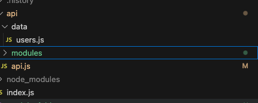

# **Node JS Express for FrontEnd Developers Part Three: Understanding Routing**

In [Part Two](https://www.linkedin.com/pulse/node-js-express-frontend-developers-part-two-building-jonathan-gold-tji3f/?trackingId=GikAU8DkTDWCPPvxtCdQxQ%3D%3D), we had created endpoints to query and authenticate users. Using the Express Framework, you create endpoints by defining routes. In this installment, we dive deeper into routes and routing. We will also look at how we can take advantage of routing to modularize our web applications to make them easier to maintain and extend.As with previous installments, the sample code and files for this installment can be downloaded from [GitHub](https://github.com/trider/node-task-api-tutorial/tree/main/node-task-api-part-02). 

## **What is Routing**

The Express Framework uses routing to manage and direct requests. Each route represents a path (URL) that sends a request to a handler function. The handler is a callback or middleware code that processes the request and returns a response. These are the main routes and handler functions in our application. They run at the application (app) or global level and are located in a single file. 

``` javascript
app.get('/api/users', (req, res) => {  
 res.json(users);  
});

app.get('/api/users/:user', (req, res) => {  
 res.json(users.find(user => user.userName === req.params.user));   
});

app.post('/api/users/login', (req, res) => {  
 if(users.find(user => user.email === req.body.email && user.password === req.body.password)){  
  res.json({ ...users.find(user =>   
   user.email === req.body.email && user.password === req.body.password),   
   message: 'Login successful', isAuthenticated: true});  
 }  
 else{  
   res.json({message: 'Login failed', isAuthenticated: false});  
 }  
});
```

All these routes provide user related functionality. As we are building a task management API, our next step should be to add task related functionality.  The problem is that as we add more functionality and capabilities the number of endpoints will increase in size and complexity. Over time the more code we add, the harder our application becomes to manage and maintain. Before that happens, let’s look at how to structure and organize our code to avoid longer-term management and maintenance issues.

## **Modularizing our Application**

Before we add any new functionality, we will modularize our application into smaller units organized around functionality. Let's start by adding a folder called api to our project. This folder will contain code and related data files. Move the existing data folder into the API folder. Create a subfolder called modules. Now we have reorganized our application code we can use the Express Framework’s Router middleware to move related routes into specific files. In the API folder, create a file called api.js. This file defines the top level route. From now on, all route URLs will start with /api/ followed by the route type /api/user.



Open api.js and declare a variable that references Express. Then declare a variable that instantiates the Express router middleware

`const express = require('express');`  
`const router = express.Router();`

Next, we create the /api/users route that includes a reference to the users.js module.  
`router.use('/users', require('./modules/users'));`

The final step is to add a line that exports the code and makes it available to index.js.

`module.exports = router;`

## **Creating Modules and Routes**

Once we have our top level route in place, we can create our first module. In the api/modules folder, create user.js. Add the following code to the file.

`const express = require('express');`  
`const router = express.Router();`  
`const users = require('../data/users');`

`module.exports = router;`

In the middle of the file, add the User API routes. The new user routes are almost identical to our original routes in index.js, with two key differences. The first difference is that they are defined using the router and not the application middleware. The second is that they are much shorter than routes defined at the application level.

`router.get('/', (req, res) => {`  
 `res.json(users);`  
`});`

`router.get('/:user', (req, res) => {`  
 `res.json(users.find(user => user.userName === req.params.user));`   
`});`

`router.post('/login', (req, res) => {`  
 `if(users.find(user => user.email === req.body.email &&`   
    `user.password ===req.body.password)){res.json({`  
       `...users.find(user => user.email === req.body.email &&`   
       `user.password === req.body.password),`  
       `message: 'Login successful',`  
       `isAuthenticated: true`  
     `}`  
   `);`  
 `}`  
 `else{`  
   `res.json({message: 'Login failed', isAuthenticated: false});`  
 `}`  
`});`

## **Code Cleaning Up**

Now we can clean up index.js. In index.js, remove the /api/users, /api/users/:user, and /api/users/login routes. Update the redirect to point to /api. Then, add a reference to /api.

`app.get('/', (req, res) => {`  
 `res.redirect('/api');`  
`});`

`app.use('/api', api);`

The only thing left to do is add a redirect to api/api.js that opens the default route (the list of users), when we launch the API.

`app.get('/', (req, res) => {`  
 `res.redirect('/api/users');`  
`});`

## **Conclusion and Next Steps**

In this installment, we reorganized our code and created a modular API. This will make it easier to manage and extend our task management API. By using the Express Framework’s router middleware, we built highly modular code. As a result, we were able to create simple and compact paths instead of creating long URLs for each endpoint. In part four, we will create the Tasks API using more advanced routing functionality.

[image1]: <data:image/png;base64,iVBORw0KGgoAAAANSUhEUgAAASgAAAB2CAYAAAB79A4qAAAAAXNSR0IArs4c6QAAHEhJREFUeF7tnQdc1dX7xz/3wgUUZCtDQFARF7gFMaUcpOJIJFfO/DnSyjTLlakN07RSE0eWe6AoKu7MgHDlCrcoKMqQvfe6/9dzCv5sLzLE63Ner17G/Z7vGe/vvZ/Xc57veZ4j6dGjh9zZ2Rnu7u6oqFhYWKBnz57Yt28ftLS00K9fP3h5ecHV1RUeHh4YMWIEIiIiEBQUhLi4OOjp6eHtt9/G9u3bYWdnh65du+LXX38VXYwbNw6enp4YNWoUDhw4gOTkZHTp0gVWVlY4d+4cBg0ahG3btiErK6vCMfFFJsAElJuA5Ntvv5Xv2bNHiMrzBMrR0VEIlI6OjhCoQ4cOFQoUfWZkZIS2bdsiLS0NAQEBhQLVvn17dOjQAVu3bhVdjB07VgjTu+++K0QuNTUV6urqGDNmDBITExEfHw8fHx/lJs+zYwJM4LkEJFZWVvKMjIxyK5IQhYeHIykpCRUJ1OjRo3HhwgUYGxujUaNGwhIi6+rMmTNISUnB8OHDceXKFWhqakJfXx9Hjx4F3VMgUDSAvn37wtbWFuvWrUN2dvZzB88VmAATUG4CEmNjY3lFU7SxsRECQ8swspCCg4OhpqYGc3NzhISEwNLSEo8ePYKpqakQp5ycHDx+/Bjp6enimoaGBgIDA2FgYCDq5ObmIjQ0VFhK1tbWog26hwr11bJlSxw5ckS5qfPsmAATUIjAcwVKoVaqoRL5oMhPdeLECSFwXJgAE2ACdUagyIelqqr6XF8YPzImwAReHwJ1RqBeH+Q8UybABBQlwAKlKCmuxwSYQK0TYIGqdeTcIRNgAooSYIFSlBTXYwJMoNYJsEDVOnLukAkwAUUJVJtAmTbSQX6+HJGxyYr2zfWYABNgAhUSqDaBmuLmiMzsXOzwvszImQATYAKQSiUwbagDQz1NpKRlIjQyEdk5eZUiUyhQtNObdnlTSEvRotugHgz0tCABEJuQiuS0TFiaGiAvPx8yVRUkJqcjNjENVI9KYkr5YTOVGhlXZgJM4JUlQHrRurkx7KxNIZHQX0BwWCyu3QlFbl6+wvMSAtWiRQsMGDAAu3fvRkxMTOHNajIVrJwzFOpqqtCQqSIiJgk/bDsLb/dpuBMUgZj4VFiY6GHCwt0YNaCTELGdx64o3DlXZAJMQDkJyFSl6G1vA32d+oUTTMvIht/VoEoZMZJOnTrJR44cKQJ0y0pvoq2pgQaa6mhuYYiZY3th4WpvuC8agU+/98KtoGf45iMXHPojANaWRlCVSrDtCC/xlPMrx7NiAooTIOOmj4NN4cqK7szIzIHftSDEJ6Ur3JBk0aJFcm9vb0RFRZW6qbGRLn763BU3AsMRHZ+KAT1aY+Eab6yZ/y4+/s4TD0KiMX+yM/65Fwo9HU0WKIWxc0UmoNwEaFnXoWVj2Fg2KlzihUUl4tLNJ8jOyVV48hU6ydvZNMbqecPw9cZTQpyamTcUArXt23E48ucN+F8PxlcfusB5sjuG9+/IAqUwdq7IBJSfgIpUimYWBjA31kN0XAruPYpGbt4LOsnLwqWqIoVr33ZoYmKAyNgkQCKBz98PsH3ZOBz3uw2ZTAVXbz/Bn5cfoH1LM0glEly7G6r85HmGTIAJ1AoBhbYZkPDky/9NG0U+KY9VEzFtqQfCohPF3icuTIAJMIGaIKCQQBXtmN4Ydm5tgYDAcOTkVs5cq4kJcJtMgAkoL4FKC5TyouCZMQEmUNcIsEDVtSfC42ECTKCQAAsUfxmYABOoswRYoOrso+GBMQEmwALF3wEmwATqLIEqCxQddECnCBeN4auzs+WBMQEm8EoRqLJAtWrVCl999ZU4Jbis4uLiglu3buHp06evFBgeLBNgAi+fQKFAGRoaiiOf5P9tyKShSaVScQpwbGxsqZHKZDKoqKigdevWWLJkCQYPHoyCz6gNOoyTrru7u2Pv3r3w8/MT7ZHFVXA9P1/xtAsvHxWPgAkwgdomUChQQ4cOFacBnz59unAMlIKFgv6OHz9ebFwNGzbEokWLhKCRsFlZWWHs2LHis8zMTJiYmODUqVPi+tSpU8XJw5s2bRJHnZNA0T1///03du7cWdvz5f6YABN4hQgUChRZO6NGjRJHkh87dgxDhgwRR5wfPHgQJS0dEjM6aJMEpm/fvpgxY4aoTxYUHXVOyz0SrS+++AIbN27Erl27cO7cOdEe1aG6ZHGNGDHiFULFQ2UCTKC2CRTzQZF1Q+JCTm9Kv3L48GHklRF9PG3aNISFhQkhc3BwwMKFCzFr1izx7/3798X9dF+BQJGQXb9+Hd9++y0iIiKEuNHS0NXVtbbny/0xASbwChEo5SQnP5Guri4SEhKK+aOKzsnW1haffPIJli9fDjc3N3Tv3h0//PCDsKS+/PJLTJw4EdnZ2UKgVq9ejStXrohlIiXFmzNnDsaMGYPOnTuzBfUKfVF4qEzgZRB4obd46urqwvqxsbERDnQtLS2sX78e48aNE0716OhokducnOMdO3ZEv379cOjQISFK1tbWheJH4sWFCTABJlAegRcSqILGyJ9Eb+uKFlom0uELRQtZZQV+LPJDkXXFhQkwASbwPAJVEqjnNc7XmQATYAJVIcACVRV6fC8TYAI1SqCYQNFWg7Le2tXoCLhxJsAEmEA5BIoJFL29o31QXJgAE2ACdYEAC1RdeAo8BibABMokwALFXwwmwATqLAEWqDr7aHhgTIAJVChQdIKLpaUG4uNzkJSUB2NjGTQ1VRAekY3MjJeTiYB2q1PYzMWLF/npMQEmoOQEKhQomaoEa9Zawds7AVoNpBgyWB+0B9Pd/RmuXk19KWjq168vNoeW3CD6UgbDnTIBJlCjBCoWKJkEmzY1EwLl4KCFuPhc/PZrlLCm8vKKH9hJAcAUa7dgwQKEhoZi7dq12LBhA9q0aYM33nhD7CS/d+8eNm/ejClTpohgYdp1fuLECTx8+BDz5s0TO8xPnjwJMzMzEUZDu87Pnj0rMioU5Kn66KOP4OPjg7S0NMyePRspKSkiJQz1WzSXVY1S48aZABOoFQIKCZSXVzwePEjH1GnGUFeTYtWqcISEZBUbIGUwIIGijAYhISEi/xOJ1MyZM0VGzd27d4tULJTNgK5RXRIiyiO1dOlSLF68WAQg0zYHDw8PkSnhyJEjIukdpRMuEB8SpTNnzoicUhSovGLFCnGNRJELE2ACykWgXIFSUZHAykodS5aYY8uWaNy/nwGZTIJPPjHFlaup2LM7phgJ2kNF2TNJaIKCgoSlRMHAtPGT8j6RGJHviETnp59+woMHDwrj8yiQ+OOPP8b7778v2iSLy9nZGRYWFkKMKOi4IJavQKAo3QsFJzdt2lTE/lHmhIyMDOV6OjwbJvCaEyhXoEwby7BwoQUin2Vj8+ZIjB9vhMZmMkRF5eCXTVGIiSkdJPzbb7/B19dXLOVISChXef/+/eHv7y8wT5kyGZMm/Q9btmwR2Q/IOurVq5dYws2dO1cIFC3raLlHFpSpqSmcnJyE+AwfPlzkp5o8ebIQLSMjI5F36tKlSyLFCwkjWWdcmAATUB4CldpmQG/1iqQsL0Vh4MCBwvIhqyk1NRXbtm0TFs6gQYNEXUonTHmhevfuLTJqUnuHDx9BcHAwxo8fLwSNCi377O3tRTtkXZHoUe4pyjk1YcIEkU6Y0rzQ8lFbWxuBgYFYs2aN8jwVngkTYAKCQKUEShFm5Pim5VjRNMGUloX8REXTsJD1RGlYynsbR/dQ/QLfEznCHR0dRTK8lStXClGiz8ivxUs7RZ4M12ECrx6BaheomkRAb/boTd/jx49rshtumwkwgTpC4JUSqDrCjIfBBJhALRGQmJiaFW5o0tHVRRJnM6gl9NwNE2ACzyMgse4/v/iOy+fdwdeZABNgArVAoH5z5+JO8lrok7tgAkyACShEwHDAGhYohUhxJSbABGqdAAtUrSPnDpkAE1CUQCmBovPuKJ0JxcLV5K5sIztLtHa1h8+SfWWO9a2lI3HH8wKibz9VdC5cjwkwgbpGQAKoaqhBVV2GvJw85GZkQZ6vuMu7TAvKxMQEQ4YMwY4dO5Cenl4jUzbv1gIdxveC97SNZbY/+JcPcO3XPxB++WGN9M+NMgEmUPMENI100LC1OVTUZcjPzUNC0DMkPY1VWKTKXeJReMrIkSNFwC9lEihZ9K1NYP/hAEikEuTn5CLhcbQYiDw3F2cW7IaGjhYc5wyGqkwVGYlpuPjTUeTn5cNx9iDU19MSu8NV1dXg8/V+9FwwDMc+2CS6GOg+Bf4rDsHpCzchUAmPotBt1iDU062PhJAYXHY/iYZtzNBuzJuQSiUIvfQAN3f/VfOkuQcmwAQqRUAilcK0a3NoNtIpvC8rOV0YHbnpih3cW6EPaujQoUJIKEC3lEDZmKL9GCdcXH0U7Ub3hERNFTd3+qHv8rG4vuUPWPfriJh7YQg6HYCWQ7ogLSYZGrqakGmo4fb+82g5uAua9GwDv2888ebiETg88WfRxTu/zYDf157osWCYEKiWg7ogKSwWD38PgO273RF0JgCWTm2Qm5GNwKNXoWmojcibIZUCx5WZABOoeQISmQrMu9mI331BycnIEgKVnaRY1pEyBYri2zp37iyCfr///vsyY+X0bUxh5dQG1345g3ZjnJCZmo7Aw1cwaMM03D96GS36d8Tf608h9l4YDG0ao2lfO+g0NsBj39tCtJr0aCWsoL++O4i3Fo/Aofd/BuTAO1s+hN9X+wsFquc8V2SlZCAn/d/cU4HHrwrhs5/eH/X0tRDy1138s/XPmqfNPTABJlA5AhIJjNtbQtvcsPC+jPgURFwJRl5W8Uwo5TVcpkB17dpVZLPcv38/srKKJ6UraKgigbrteR6WPVsLq+nOgQvoOLE3Im+EQKapDj1LI1z99Xe0G+0E045NcWbhbvRd9h7+Xn9SBP46fOQCnyUe6DH/XwuqWZ92SI9Lxq29/rB0aovIgMcwsm2ChJAoyOqrw+FDF3hNWFs5cFybCTCBWiGg1kADek2NoaGjiey0TCQ+ihQuHzJGFCmlBIryfc+aNUtkC6Cg3PKKXjMjNOneCgE7fNF2RHdkJqcj6OQ/6Pfj+7h3+BLCrwbj7ZXjoKnfAHHBkfBf7iWcZD0XusHQ2lSITn5uPk7M/A2dpvRFs7dskZGQCnLwn19xCN0+HYyA7T5CkJxXjIOOuWFhO8Z2TdBl6tuQqkpx98hl3Nl3XpG5ch0mwAReMQI1uw9KIhEikp+TVwyLan115P63ZCu4IJWpQJ6XX653X7WemvA7FdZXlYKccHnZua8Ych4uE2ACihKoWYFSdBRcjwkwASZQBgEWKP5aMAEmUGcJCIFq95GPgi6rOjsPHhgTYAJKSEBaT5eDhZXwufKUmIDSECiWUVNpZsUTYQJMQCkIsEApxWPkSTAB5STAAqWcz5VnxQSUgkChQNFJwhoaUqSl5UFVVQItLRVkZeUjIzNf4Z2fJYk0MtCC+8Lh+HTlITx9liAujx7QCcaG2li9yxf5lUi9oBS0eRJM4DUh8LajDbS16uHQ2ZvIzcuHupoqJgzpilPn7+FJxL9aoEgpFCgzM3W4uRlg3bpnmDSpESyaqONRcBZ27oxGdvaLvejTUFeFva0lrt55irT/NlpaNTZAPQ0Z7j2KrPAQUEUGz3WYABOomwQWTXsbZkZ6WPTzcUTHp8C1jx1cerYVhsmtB4qfAF4oUM2aaeCDD0ywamUYFi81x7y5T5Ceno/cXHkpITHQ1cQPnw2FhYk+QsLjMHWpB8YM7IJObczRqqmJOBF45vIDCHoaiwM/TcKMb/YjLCpRkBzZryMM9bWw3sMfP80dhjbNTRAdl4LPVh1CeHRS3aTNo2ICTKBSBEigmpjo4+bDCGzw8MfSGS5oqKeFtXv8qiZQ8+eHYOYnJrBsooHDh+Ph45OEvLziFpSRQQPY21niSUQcZoxywt4TV9HMzBC9HGzw3ebTcOpiDVtrU3y60gv7Vk3C9K898OS/Jd7Ed+zRQKsevP+8CfdFI7Bs0yno62jiyp2niIxNrhQErswEmEDdJEACJc8HTBvpwPP3fzDoTVskpWTA6+yNFxOozp014eZmiHnznkAiAWxt62P6DBPM/TwESUnF4+mamRtgw5ejoK2lIeis3+MHNZkq8uX52HLob9TXkGHXivGYveIg3L8YWaZArd3liw2LRqBDK3OERiXg0++9Cv1UdRM5j4oJMAFFCZBA3QmKhGOHptBQU4X/tWA0t2gIb99blRMoc3MT+bvDDdGpoxbOn0/GxYspmDLVSPidYmJysGN7aR/Uomn9IFNVwc97/LB0ugsu3XgkBIosp4Vrj8LZsSUc7Kww6/uD8Fj5vhCoFlZGuBscCeduNsKCOuZ7C62aGovPvvrIBZ6nr8Pb57ai8+d6TIAJ1GECBQIVFZeC0S6dsXT9SUx2c4S3z03cevhM4ZFLTEyM5fXrS0U+poyMfHEj/S2XQ7zFy8kp7SDv0MoMq+YMFW/hyEO/+9hlaKjJ0NvBBsaGOpCqAHO+90JAYDgOr50qBGrrsrFYu8sPeg00hEBt2n8O+1a9D6366kjNyMKclV7CZ8WFCTCBV59AfQ01oQ05uXliRZWemYN66jJk5eQiL+9fnVGkvPA+KDLbpCpSpP/3du5/rt3EmzpaY9LASg6CBNDEUBuLp/fHtbuh+MXzvFhK6jSoh8RkxVKAKjIhrsMEmIDyEHhhgSqJoEtbCySnZiIwJLpcOi2aNISdtQl+v/RA1OXCBJgAE6iIQLUJFGNmAkyACVQ3ARao6ibK7TEBJlBtBFigqg0lN8QEmEB1E2CBqm6i3B4TYALVRoAFqtpQckNMgAlUNwEWqOomyu0xASZQbQRqRKAaN24MOzs7nDx5stoG+ryG3NzccPHiRYSHh5eq2rZtW6Snp+PRo0fPa4avMwEmUIcISFxdXeX0w5bT1vFqKi1atED79u3F6cS1VaZPn44zZ87g4cOHpbq0t7dHYmIiAgMDa2s43A8TYALVQECyYMEC+ZUrV3Dr1q1SzUmlUowdOxYpKSkwNTXFzZs3ce7cOWhoaGDw4MFo2LAhbt++DV9fX9CpxEOGDIGBgQHCwsIgk8mEQDVp0gT9+/dHfn4+Tpw4Ia6VLIaGhnjrrbegqamJevXq4ezZs+jdu7eoRm3ExcWhZ8+eaNeuHWJiYkQ7ycnJ4u8ePXogKSkJDRo0EALl6OgIPz8/hISEoFevXrhz5w4sLS2FQJF4vfHGG0I8IyIi4OXlBZrjwIEDYWFhgdjYWNFfbi4fCFoN3y1ugglUmYCkTZs28smTJ2P58uWlGlNRUcGkSZPED5uWR3369MHRo0fRrVs38YO/d+8e3nzzTfzzzz9CrHR0dHDjxg0hAlSOHTuG8ePH46+//oKqqipatmyJffv2lerHyMgIQ4cOFQJjZWUFGxsbeHt7w8HBQSzZ4uPj0aFDB/j4+MDa2lr0Q0JJgkj/qqurCxGke/r27VtoSZHwXL9+Hebm5mK8qampQtDoHhI3EqKgoCBx75EjR2BmZobQ0NAyRbTKpLkBJsAEKk1AMnPmTDlZE/7+/uUKFP3wIyMjMWrUKJw/fx4DBgwQ4kPWEIlIo0aNQGJGlg9ZNuTzad26NQICAoR1kpaWJtomIVm7dm2ZAkVtbt26FXZ2tujcuQu2bNkCWpqpqakJq4xEioTO2NgYLi4uon+yqjw9PUV7H3/8sfB5VSRQNE6ynrKyskS7tKzdtm2bEDptbW1hQR0/fhwZGRwbWOlvEt/ABGqAgGTq1KlysopoCVayFFhQZF1ERUVh5MiRuHDhgrCQaOl0//59sYyia2TVkJVCn5Fw0N9//PEHyHl94MABIQokNE+fPi1ToMiKIbGwtbVFly7/ClTXrl2FqGVmZool5unTp9GsWTO0adNGiCEJFY2NlpPjxo0T1h1ZdLQUpf+GDRuGP//8s9CCojnSco+EjsZH95Gg6uvri39JqJ48eSIsNS5MgAm8fAISU1NTeVniREMrEKjDhw8jOjq6UKBycnLg7OwsUrTQD5usGT09PfEDp2v0X3Z2trBuyAoiQaE+aKlIy6uShZZ4/fr1w/bt24X1RcJEAkVCRQJ1+fJlIUYkKlRInMjqIzFq2rSp6IssoFOnTgnRoc/JCqL/p7EVLPHIL0WWGrVDcyPBI/F75513RBvUFwkezZULE2ACL59AlbYZkLOcfuBFC/3IyVoqWsj/VFBIxEoW8mXdvXv3uTTKa5uWapQHvaBQfyU/KzlGEtGiwkxLPvqsOt9mPndCXIEJMIEKCVRJoCrLliwu2iNVstBbQnoTx4UJMAEmUJRArQoUo2cCTIAJVIYAC1RlaHFdJsAEapUAC1St4ubOmAATqAwBFqjK0OK6TIAJ1CoBFqhaxc2dMQEmUBkCLFCVocV1mQATqFUCFQoUBe9++eWX2LlzpwgKrqhQfB7t8t61a1elJ/DNN99g48aNHANXaXJ8AxNQbgKSefPt5NoNVHD0aDwePy6+wZI2YlL8HYWLUAhIRYV2enfv3h0LFiyoNDEKU6EMBRQLx4UJMAEmUEBAsuy7DnLvIwmIj89BcvL/78amCpSKhCwoDw8PDBo0SOy8pvQpFIdHgb208XLu3LkikwHtwqZd5SRQVLd3717IysrGmjVr4OTkJEJh1q9fj6+//hq+fr44+8fZwqdA91B7lMWAwk5oVzj9/TyrjR8jE2ACyk1A4n20u/zUiUSc/j0BaWnFA4YpXm3z5s3YtGkT3nvvPcTHx8Hf/5xIwbJixQqRIoVEqyCtCmUt2LFjBxYuXCgChJs3by6Cczds2ID58+eLAF5KuTJ79uxiO8cpSJiEi1K+UDoWapNSoVAWBS5MgAm8vgQkffo0lU+ZYgR//xR4ehZfYpUUqD179uDSpUvCEiKr6sMPP8S6detEdoAhQwbD3t5BpDwhAaI8SxQ7p6urK6wqSgj3+eefgzJfUqBv0VIgUJQEr1WrViIH1MGDB9mCen2/lzxzJiAISObPt5N36KCJPXticelSSjEsJQWKsg1cu3YNP//8s7CQKNsm+Y4ohxL5qijVL2U+mDBhAubNmyeS1GlpaQnf0pIlS0TKFMreSaJG2QdoiUh5nkigyFFOVhNlIRg9erRYNr6IP4ufKxNgAspDQDLMzVoeG5OLhw8zUDIlVIFA0Ru2MWPGCCGhDJWUdI4sHMpQOXXqVJHMjtKekCOdln6fffaZSN9LFhTlhyKBokyW5I+iZdzq1atFShUSI3d3d+FvWrZsmVg6UjYBEjYSwr179yoPaZ4JE2AClSZQ5X1QlHOJxIiS1RUtJE5kIZVMx1K0DjnhyZL68ccfsXjxYpFul5aElGOqvBxVlZ4h38AEmMArS6DKAlXVmU+ZMgXBwcHioAM+rKCqNPl+JqBcBF66QCkXTp4NE2AC1UmABao6aXJbTIAJVCsBSau2ttV3Yme1Do0bYwJM4HUnIGlta8cC9bp/C3j+TKCOEmCBqqMPhofFBJgAwALF3wImwATqLAHJ5HcWyG+Gn0dKZkKNDNLirVZIDI5G8tO4Uu1rWxhAp2kjhPreU7jvBhYGaDagHYKPBSAlLL7UfbYTeyLI+zoy4lILr2k11oOmiS6irj5WuB+uyASYQNUIaOhrol4jbSTcfyYa0rE0RGZSOrIS0hVu+P8AfUx/b6aylAcAAAAASUVORK5CYII=>