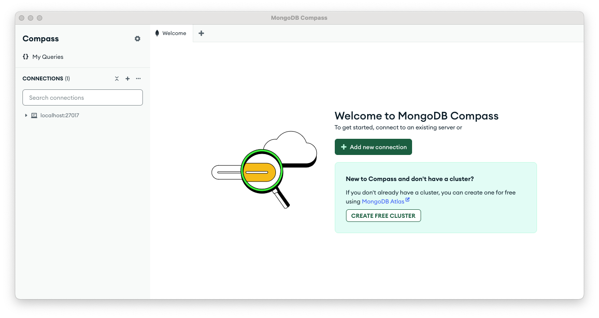
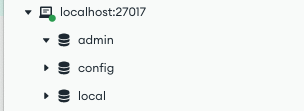
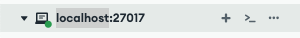
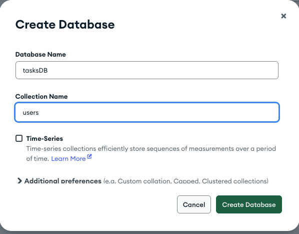
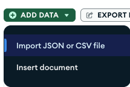
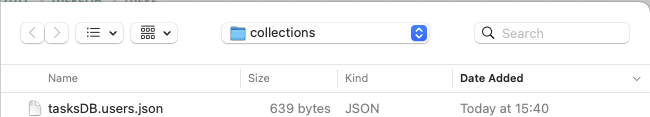

# **Node JS Express for FrontEnd Developers Part Five: Managing Data with MongoDB**

In [Part Four](https://www.linkedin.com/pulse/node-js-express-frontend-developers-part-four-querying-jonathan-gold-ctuef/) of this series, we created a fully functional task management API. We started by using routes to modularize our application code. Next, we explored how to create routes with default and optional parameters. In addition, we implemented task management functionality using HTTP POST, PUT, and DELETE commands. Despite our API’s increased sophistication, it lacked the ability to save and update data you created or modified. In this installment, we will remedy this problem by adding database support. As with previous installments, the sample code and files for this installment can be downloaded from [GitHub](https://github.com/trider/node-task-api-tutorial/tree/main/node-task-api-part-02).

## **Getting Started with MongoDB**

The term [database](https://www.techtarget.com/searchdatamanagement/definition/database) is an umbrella term for a broad range of technologies. Each data management technology enables you to persist data to a storage medium and let you retrieve and modify it. A discussion of each competing database system and their relative merits is beyond the scope of this article. For the sake of simplicity, our task management API will use a [document database](https://www.dataversity.net/fundamentals-of-document-databases/). Broadly speaking, document databases store data in a hierarchical data structure, or document. Each document is similar to the Javascript data files we have used up to this point. In our case, we will be using [MongoDB](https://www.mongodb.com/resources/basics/databases/document-databases). MongoDB stores documents in a proprietary format called Binary Javascript Object Notation (BSON), which is closely related to JSON. MongoDB, like most document databases, lets you organize multiple, related documents into collections.

### **Installing MongoDB**

In this tutorial we will be using MongoDB Community Edition. This is a free version of MongoDB and runs on nearly every available platform. For detailed instructions on how to install MongoDB locally, click this [link](https://www.mongodb.com/docs/manual/administration/install-community/).

### **Installing Compass**

After you install MongoDB, you should also install [MongoDB Compass](https://www.mongodb.com/docs/compass/current/). MongoDB compass is a graphical frontend for managing MongoDB databases, collections, and documents. When you launch Compass, the home screen is displayed.



### **Creating the Tasks Database**

In the Connections list, open localhost:27017. This is the local database server installed on your PC. Under the parent node, you will see the admin, config, and local databases. Each of these databases is used for storing internal database information.



To store tasks, we will create a database called tasksDB. Click localhost:20717 the following is displayed.



In the Create Database dialog, create a database called tasksDB with a collection called users.



### **Populating Collections**

Once we have created tasksDB and its users and tasks collections, all we need to do is populate each collection with data. To simplify the process, I have created [a JSON file](https://github.com/trider/node-task-api-tutorial/tree/main/node-task-api-part-05/api/collections) that you can use. After downloading the file, open a collection and click Add Data \> Import JSON or CSV file.



Then, select the file.



## **Integrating MongoDB**

Before we can take advantage of MongoDB, we first need to install a driver. To install the MongoDB driver, open the project terminal and type:

```javascript
npm i mongodb
```

Note that the code in this tutorial should work with the latest version of the MongoDB driver, but if you experience problems, I recommend installing version 3.6.0. To install this version, open the project terminal and type:

```javascript
npm i mongodb@3.6.0
```

### **Creating the Mongo Module**

After installing the MongoDB driver, we will create a module that lets us interact with MongoDB. In api/modules, create a file called mongo.js. Open the file and declare a variable that references the MongoDB client.

```javascript
const { MongoClient } = require("mongodb");
```

Next, declare a uri variable which points to the local database.

```javascript
const uri = "mongodb://127.0.0.1:27017";
```

Now, we will declare the mongoAPI object.

```javascript
const mongoAPI = {};
```

At the bottom of the file, add the module export.

```javascript
module.exports = mongoAPI;
```

### **Building the MongoAPI**

The mongoAPI object lets the user and tasks modules query, create, and update objects. Each API action will be implemented by a single function. All the functions share the same basic structure, so once we have created one we can create the others quickly. The API is implemented using async and await calls. Async and await simplifies the writing of asynchronous code. The async keyword declares that the function that returns data at some point in the future. Each function will receive an args object. This object includes arguments that tell the function the target database, collection, query.

#### **Querying an Item**

Our first API function will let us create a query that accepts arguments and returns a single object. In the mongoAPI object, declare a variable called client. This variable will connect to the database specified in the URI variable. Next, we use the await keyword to create the connection.

```javascript
const mongoAPI = {
 async getItem(args) {
  const client = new MongoClient(uri,{});
  await client.connect();
 }
};
```

Now we can connect to a database and collection.

```javascript
const database = client.db(args.db);  
const data = database.collection(args.collection);
```

Next, we declare the response variable and assign it the results of our query. In this case, we are looking for a single item in a collection. We can locate a single query with the MongoAPI’s findOne method. This method reads the arg’s object query argument. We will explain query syntax later in this article. If the query is successful, a response (res) is returned. If any error occurs, it is caught and the error message is displayed in the console.

```javascript
 const resp = await data.findOne(args.query).then(res => {
   return res
 }).catch(error => {
   console.log(error)
   return {status:error}
 });
```

Once the result of the query is received, the database connection is closed and the result is returned to the calling function.

```javascript
await client.close()
return resp
```

#### **Querying Items**

Our second API function will let us create a query that accepts arguments and returns a list of objects. Following getItems, add a comma. Copy and paste the previous function. Rename the function from getItem to getItems.  Remove the middle section of the function as shown below.

```javascript
}, 
async getItems(args) {
   const client = new MongoClient(uri, {  });
   await client.connect();
   const database = client.db(args.db);
   const data = database.collection(args.collection);
   
   await client.close()
   return resp
```

To return a list of items from a collection we use the MongoAPI’s find method. The query accepts a query and a list of options. In this case, the options set the default sort order. The list is then converted to an array. The following code replaces the code you deleted from the middle section of the function.

```javascript
const resp = await data.find(args.query,{ sort: {  } }).toArray().then(res => {
   return res
 }).catch(error => {
    return {status:error}
});
```

## **Updating the User Module**

Having created the MongoDB module we can now update our user and tasks routes to use it. Open api/modules/users.js. Locate the first function:

```javascript
router.get('/', (req, res) => {
 res.json(users);
});
Replace
```

Replace the function with the following code.

```javascript
router.get('/', (req, res) =>{
  const getData = new Promise((resolve) => {
     mongoAPI.getItems({ db: 'tasksDB', collection: 'users', query: {  } }
  ).then((data, err) => resolve(data))
 }).then((data) => {
   return res.json(data)
 })
 return getData.then(data => data).catch((err) => console.log(err))
});
```

Here we have added a promise. A promise is a means of writing asynchronous code. The promise lets us break our function down into individual sections. Each section must be performed in sequence. The first section sends a request to the mongoAPI module's getItems function. The function includes arguments that specify the database to query, and a query that returns all the users in the collection.

Now, let’s update the GET /:user route. Replace the existing route with the following code:

```javascript
router.get('/:user', (req, res)=> {
  const getData = new Promise((resolve) => {
     mongoAPI.getItem(
       { db: 'tasksDB', collection: 'users', query: { "userName": req.params.user } }
     ).then((data, err) => resolve(data))
   }).then((data) => {
     return res.json(data)


   })
   return getData.then(data => data).catch((err) => console.log(err))
});
```

Here we have replaced getItems with getItem. We have also added a query that retrieves user data according to the supplied user name.

Finally, let’s update the login. This is similar to the previous route with two small changes. First, the query uses the payload sent via req.body. Second, a new section has been added in the middle that evaluates the result of the query. If the query returns data, a status message and isAuthenticated flag (true) is appended to the data. Otherwise, if no data is returned only a status message and isAuthenticated flag (false) is returned.

```javascript
router.post('/login', (req, res) =>{
 const getData = new Promise((resolve) => {
   console.log(req.body)
   mongoAPI.getItem(
     { db: 'tasksDB', collection: 'users', query: req.body }
   ).then((data, err) => resolve(data))
 }).then((data) => {
   if(data !== null) {
     data = {
       ...data,
       status: "User found",
       isAuthenticated: true
     }
   }
   else{
     data = {
       status: "User not found",
       isAuthenticated: false
     }
   }
   return res.json(data)
 })
 return getData.then(data => data).catch((err) => console.log(err))
});

```

## **Conclusion and Next Steps**

In this installment, we integrated the User API with MongoDB. We started by installing MongoDB, creating a database, and populating the users collection. Next, we created a Mongo module that enabled us to query a single item or items from MongoDB. We concluded this installment by updating the Users module to take advantage of MongoDB. In the next installment, we will continue by updating the Tasks module.
