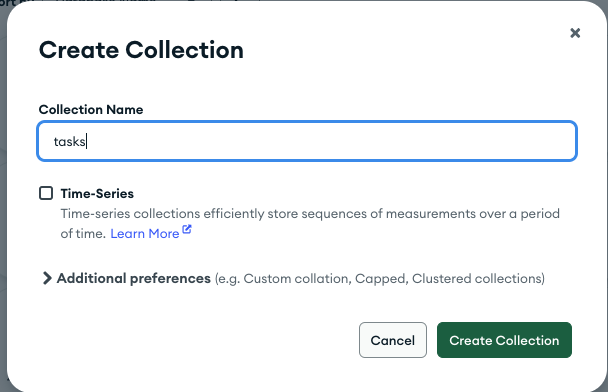
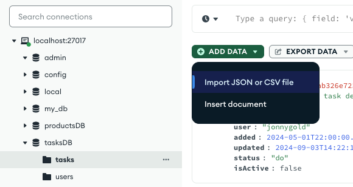
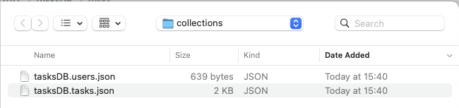

# **Node JS Express for FrontEnd Developers Part Six: Task API Integration**

In [Part Five](https://www.linkedin.com/pulse/node-js-express-frontend-developers-part-five-managing-jonathan-gold-xkq2f/?trackingId=IIFGsJ%2BmSD6b4EpWCf5eZQ%3D%3D) of this series, we integrated the User API with MongoDB. We started by installing MongoDB, creating a database, and populating the users collection. Next, we created a Mongo module that enabled us to query a single item or items from MongoDB. We concluded this installment by updating the Users module to take advantage of MongoDB. In this installment, we will add and populate a new taskDB collection named tasks. Next, we will update the Mongo module with functions that create and update a document in a collection. Finally, we will integrate the existing and new MongoDB functionality with the existing Task API routes. As with previous installments, the sample code and files for this installment can be downloaded from [GitHub](https://github.com/trider/node-task-api-tutorial/tree/main/node-task-api-part-02).

## **Creating and Populating the Tasks Collection**

In the Connections list, open localhost:27017. Locate tasksDB and click the Plus icon.


With the Create Collection dialog, create the tasks collection.



From this [link](https://github.com/trider/node-task-api-tutorial/blob/main/node-task-api-part-06/api/collections/tasksDB.tasks.json), download the tasksDB.tasks.json file. After downloading the files, open a collection and click Add Data \> Import JSON or CSV file.



Then, in the File browser select the file.



## **Querying MongoDB Tasks**

After we created and populated the tasks collection, we can proceed to update the tasks module’s query function. First, in the top section of the file, let’s add a reference to the MongoAPI module.

```javascript
const express = require('express');
const router = express.Router();
const mongoAPI = require('./mongo');
```

First, let’s update the GET /api/tasks/user/:user route. This route returns all the active tasks assigned to a user. To update the route, locate the /user/:user route, and replace the existing handler function code with the following.

```javascript
router.get('/user/:user',  (req, res) =>{
  const getData = new Promise((resolve) => {
     mongoAPI.getItems(
       { db: 'tasksDB', collection: 'tasks', query: { user: req.params.user, isActive:true } }
     ).then((data, err) => resolve(data))
   }).then((data) => {
     return res.json(data)


   })
   return getData.then(data => data).catch((err) => console.log(err))
});
```

The code is almost identical to the GET /api/users/:user route we created in Part Four with minor details in the query. The first change is that instead of querying the users collection, the function queries the tasks collection. In addition, the query matches the values of two fields: user and isActive. The user field indicates the user to which the task was assigned. The isActive field is a boolean value (true or false) that indicates if the task is currently active. The significance of isActive will be explained later.

Now, let’s update the GET /api/tasks/task/:taskId route. This route returns a single task identified by its taskId. Locate the route, and replace the existing code with the following.

```javascript
router.get('/task/:taskId',  (req, res) =>{
  const getData = new Promise((resolve) => {
     mongoAPI.getItem(
       { db: 'tasksDB', collection: 'tasks', query: { taskId:parseInt(req.params.taskId)} }
     ).then((data, err) => resolve(data))
   }).then((data) => {
     return res.json(data)


   })
   return getData.then(data => data).catch((err) => console.log(err))
});
```

Again the new code looks familiar but has one minor difference. As with the original code, we have to convert the route's taskId parameter from a string  and the taskId is an integer. In this case, we have to convert the parameter’s data type because MongoDB stores the taskId as an integer. As with the previous version of the function, we use Javascript’s parseInt command to convert it into an integer.

## **Managing Tasks**

In this section, we will update the Mongo module with functions that create and update a document in a collection. To do this, we will first update the mongo.js module and then we will update tasks.js.

### **Updating the MongoAPI Module**

Open api/modules/mongo.js. Following the getItems function, add a comma. Copy and paste the getItem function. Rename the function to writeItem. As the name suggests, the function will add a new document to a collection. The function uses the Mongo API’s writeOne method to create a new document in a collection. The method receives the data with which to create the object. Remove the middle section of the function and replace it with the following.

```javascript
const resp = await data.insertOne(args.data).then(res => {
  return res
}).catch(error => {
   return {status:error}
});
```

Now we will add a function that updates an existing document in a collection. The function uses the updateOne method to update a single document in a collection. The method receives a query and two additional parameters. The $set parameter receives the data with which to update the object. The upsert parameter, if set to true, creates a new object if the target object does not exist. Following writeItem, add a comma. Copy and paste the getItem function. Remove the middle section of the function and replace it with the following.

```javascript
const resp = await data.updateOne(
  args.query, { $set: args.data }, { upsert: true }    
).then(res => {
  return res
}).catch(error => {
  return {status:error}
});
```

### **Updating the Task API Routes**

With our two new Mongo API functions in place, we will now update the three task management routes in /api/modules/tasks. Note that to simplify our application code, all the new functions use the HTTP POST command.

First, locate the POST /add route and replace the existing code with the following:

```javascript
router.post('/add', (req, res) => {
  let tasks = null
     let taskId = null
     const getData = new Promise((resolve) => {
       mongoAPI.getItems({ db: 'tasksDB', collection: 'tasks', query: {} }
       ).then((data, err) => resolve(data))


     }).then((data) => {
       tasks = data
       taskId = tasks.length + 1
       return mongoAPI.writeItem({
         db: 'tasksDB',
         collection: 'tasks',
         data: {
           ...req.body,
           taskId: taskId,
           added: new Date(),
           updated: new Date(),
           isActive: true


         }
       })
     }).then((data) => {
       return mongoAPI.getItem({db:'tasksDB',collection:'tasks',query:{"taskId":taskId}})
     }).then((data) => {
        return res.json(data)
     })
     return getData.then(data => data).catch((err) => {
       console.log(err)
     })
 });
```

The updated function accepts the same payload as the previous version of the function. In order to generate a unique taskId, the first section of the function’s promise queries the tasks collection to determine the current size of the collection. The second section creates a new taskId by incrementing the current number of tasks by one. In the next section, the Mongo API’s writeItem method is used to add a new document to the tasks collection. The method’s payload includes the target database, collection, and data. The data object includes the received payload, a taskId, two date fields (added and updated), and an isActive flag. The third section retrieves the new tasks from the collection by its taskId. This last section returns the results of the query as a JSON object.

Next, locate the PUT /update/:taskId route and replace it with the following code.

```javascript
router.post('/update/:taskId', (req, res) => {
  const getData = new Promise((resolve) => {
     mongoAPI.updateItem({ 
       db: 'tasksDB', 
       collection: 'tasks', 
       query: { taskId: req.params.taskId }, 
       data: req.body 
     }).then((data, err) => resolve(data))
   }).then((data) => {
    return mongoAPI.getItem({
     db:'tasksDB',collection: 'tasks',query:{ taskId:req.params.taskId }
    })
   }).then((data) => {
     return res.json(data)
   })
   return getData.then(data => data).catch((err) => console.log(err))
});
```

Here we don’t need to generate a taskId, so we can start with the relevant Mongo API (updateItem) method. In order to locate the target task document, the method includes a query. In this case, we locate the task using the route’s taskId parameter. The method data receives the route’s payload and sends it to the database. The next section queries the tasks collection and returns the updated task document. The final section returns the query as a JSON object.

The last route to update is DELETE /task/:taskID. Locate the route and replace it with the following code.

```javascript
router.post('/delete', (req, res) => {
 const getData = new Promise((resolve) => {
   mongoAPI.updateItem({
       db: 'tasksDB',
       collection: 'tasks',
       query: { "taskId": req.body.taskId },
       data: {
         isActive: false,
         updated: new Date()
      }
 }).then((data, err) => resolve(data))
 }).then((data) => {
   console.log(data.result)
   return mongoAPI.getItem(
     { db: 'tasksDB', collection: 'tasks', query: { "taskId": parseInt(req.body.taskId)} }
   )
 }).then((data) => {
   return res.json(data)
 })
 return getData.then(data => data).catch((err) => {
   console.log(err)
 })
});
```

Note that the code doesn’t delete the task from the database’s tasks collection. This is because there may be cases that you want to reinstate a task, but do not want to show a shorter tasks list. It also simplifies our MongoAPI module because we no longer need to implement this function nationality. Now we can use the updateItem method instead. So, to delete a task we mark the task as inactive (isActive:false). This explains the existence of the isActive flag. Another thing to be aware of is that this route uses a payload instead of a parameter. This means that when you want to use this route, you must uses the following path and payload.

```javascript
POST /delete

{
    "taskId":4
}

```

## **Conclusion and Next Steps**

In this installment, we created and populated tasksDB’s task collection. We updated the mongo.js module to create and update tasks. We integrated tasks.js with MongoDB. This enhanced our existing querying functionality and enabled us to persist, update, and delete tasks from the database. We implemented the delete functionality by declaring a task to be inactive or active. As a result, we can reinstate deleted tasks by not removing them from the database. In the next installment, we will look at how we can test our code. On the subject of testing, I have updated the Postman collection to include all API routes and support the latest functionality. You can download it from GitHub with this [link](https://github.com/trider/node-task-api-tutorial/blob/main/node-task-api-part-06/node-task-api.postman_collection.json).
