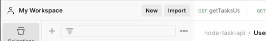
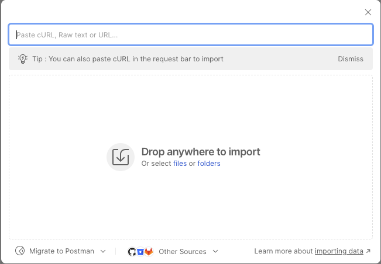
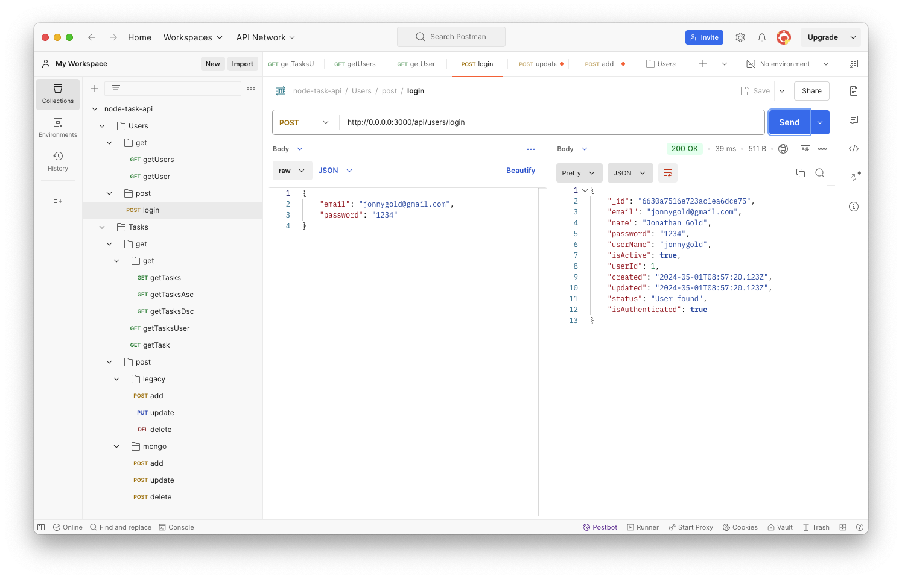
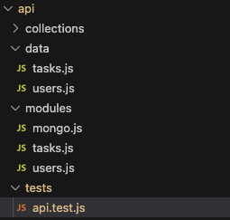
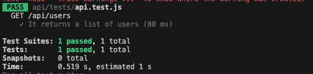
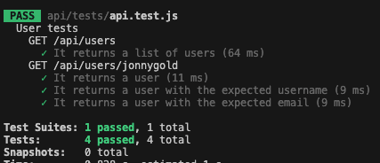
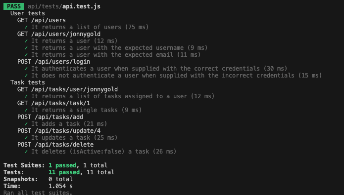

# **Node JS Express for FrontEnd Developers Part Seven: Testing the API**

In [Part Six](https://www.linkedin.com/pulse/node-js-express-frontend-developers-part-six-task-api-jonathan-gold-pi1jf/) of this series, we integrated the Tasks API with MongoDB. We created and populated tasksDB’s task collection. We updated the mongo.js module to create and update tasks. We integrated tasks.js with MongoDB. This enhanced our existing querying functionality and enabled us to persist, update, and delete tasks from the database. We implemented the delete functionality by declaring a task to be inactive or active. As a result, we can reinstate deleted tasks by not removing them from the database.

In this installment, we will test our code. We will look at two different approaches. The first approach is to use an HTTP client application, such as Postman to test individual routes. The second approach is to write automated tests with a testing framework. As with previous installments, the sample code and files for this installment can be downloaded from [GitHub](https://github.com/trider/node-task-api-tutorial/tree/main/node-task-api-part-02).

## **API Testing Using an HTTP Client**

While Postman has been mentioned in [Part Two](https://www.linkedin.com/pulse/node-js-express-frontend-developers-part-two-building-jonathan-gold-tji3f/) and Part Six of this series, it’s a very useful tool and is worth spending a few minutes to reacquaint ourselves with it. Postman is an HTTP client application that lets us test REST API endpoints, such as our Task API routes. Postman lets you send everything from simple HTTP GET and DELETE requests to more complex requests that include a payload.

If you haven’t done so already, you can download Postman from this [link](https://www.postman.com/downloads/). Once you have downloaded Postman, you can import the latest version of the node-task-api collection from [Github](https://github.com/trider/node-task-api-tutorial/blob/main/node-task-api-part-07/node-task-api.postman_collection.json). This includes both the original (legacy) HTTP routes that use POST, PUT, and DELETE, and the newer routes from Parts Five and Six that use MongoDB and HTTP POST.

Launch Postman, and click the Import button. Note that the latest version of the collection includes an updated Tasks folder.



Then, use the dialog to import the collection file.



After you have imported the collection, open any folder, select a route and press Send. A response is displayed in the Response window.



## **Creating Automated Tests**

HTTP client applications are great development tools but generally we use them to test individual routes one at a time. NodeJS, like many development environments, supports frameworks that let us automate application testing by writing code (scripts). This enables us to comprehensively test our code under a broad range of circumstances and using different inputs. We will now write automated test scripts that will enable us to test all of our existing routes.

### **Installing Testing Frameworks**

To test our Task Management API, we will use a popular Javascript testing framework called [Jest](https://jestjs.io/) in conjunction with another called [Supertest](https://www.npmjs.com/package/supertest). How and why we need these frameworks will be explained later. To install Jest, open the project folder and type:

```bash
npm install \--save-dev jest
```

Next, we install Supertest

```bash
npm install \--save-dev supertest
```

The last step is to open package.json and add and/or update the scripts as follows.

```javascript
"scripts": {
   "test": "jest"
 },
```

This will enable us to run our tests by typing npm test.

### **Modifying our Application**

Before we write our tests we need to make some minor modifications to our code. First open, index.js. Remove this code from the file.

```javascript
app.listen(3000, () => {
 console.log('Server is running on port 3000');
});
```

At the bottom of the file, enable the export functionality with this code. This will enable our test code to access the API routes.

```javascript
module.exports = app;
```

Now, in this folder, make a new file called index-server.js. Paste the following code into the file.

```javascript
const app = require('./index');

app.listen(3000, () => {
 console.log('Server is running on port 3000');
});
```

From now on, you will launch the API by typing node index-server.js. This will enable us to run the API and tests in parallel. Otherwise, when we wanted to run tests we would need to stop the API and vice versa. In addition, by splitting index.js functionality across two files, we can also split our test code across multiple files.

### **Writing Tests**

In the api folder, add a new folder called test. In the folder, create a file called api.test.js. The .test indicates to Jest that this file contains runnable tests.



Open api.test.js, and add the following. Where request references the supertest framework, and app references the app object declared in index.js. Note that we do not have to reference Jest as supertest takes care of that for us.

```javascript
const request = require("supertest");
const app = require("../../index");
```

Let's start by creating a Jest specification. The specification is a block that describes what the test will do. Here, we want to check that the GET /api/users endpoint returns a list of users.

```javascript
describe("GET /api/users", () => {});
```

The specification contains one or more tests that test specific functionality. Individual tests are declared with the it keyword. This has a description followed by a testing function. Since our test will call an asynchronous route, it is preceded by the async keyword.

```javascript
describe("GET /api/users", () => {
   it("It returns a list of users", async () => {});
});
```

Now we declare a response object to reference a supertest request method. Here we use the get method to access the route. Since each route is called asynchronously, it must be preceded by the await keyword.

```javascript
describe("GET /api/users", () => {
   it("It returns a list of users", async () => {
     const response = await request(app).get("/api/users");
   });
 });
```

When a response is returned we can evaluate the expected result as shown below. Here, the test evaluates that the response returns the HTTP 200 status code (OK). The test also checks that the response body exists (toBeTruthy). Lastly, it checks that the list of users is not empty.

```javascript
describe("GET /api/users", () => {
   it("It returns a list of users", async () => {
     const response = await request(app).get("/api/users");
     expect(response.statusCode).toBe(200);
     expect(response.body).toBeTruthy();
     expect(response.body.length).toBeGreaterThan(0);
   });
});
```

In your IDE’s integrated terminal, run the test by typing

npm test

You should see that our test ran and passed:



Having written one test that tests one user API function. Let’s test the rest. Before we do, let’s group our existing user tests in a single block as follows:

```javascript
describe("User tests", () => {
 describe("GET /api/users", () => {
   it("It returns a list of users", async () => {
     const response = await request(app).get("/api/users");
     expect(response.statusCode).toBe(200);
     expect(response.body).toBeTruthy();
     expect(response.body.length).toBeGreaterThan(0);
   });
  });
});
```

Now let’s add a test that evaluates the GET /api/users/:user endpoint by adding the following:

```javascript
describe("GET /api/users/jonnygold", () => {
   it("It returns a user", async () => {
     const response = await request(app).get("/api/users/jonnygold");
     expect(response.statusCode).toBe(200);
     expect(response.body).toBeTruthy();
   });
   it("It returns a user with the expected username", async () => {
     const response = await request(app).get("/api/users/jonnygold");
     expect(response.body.userName).toBe("jonnygold");
   });
   it("It returns a user with the expected email", async () => {
     const response = await request(app).get("/api/users/jonnygold");
     expect(response.body.email).toBe("jonnygold@gmail.com");
   });
 });
});
```

Here there are three individual tests. The first test performs a sanity check by evaluating basic functionality. The second and third attributes evaluate the userName and email field values included in the response object. When you run the test, it returns the following response that is organized according to our description blocks.



Let’s complete the user tests, by testing POST /api/users/login. Here, we will create two tests. The first test evaluates that the api authenticates a user that login with valid credentials. The second test handles invalid credentials. Each test uses the post method to send a HTTP post command and a send method to handle the payload.

```javascript
describe("POST /api/users/login", () => {
   it("It authenticates a user when supplied with the correct credentials", async () => {
     const response = await request(app).post("/api/users/login").send({
       userName: "jonnygold",
       password: "1234",
     });
     expect(response.statusCode).toBe(200);
     expect(response.body).toBeTruthy();
     expect(response.body.isAuthenticated).toBe(true);
     expect(response.body.status).toBe("User found");
   });

   it("It does not authenticate a user when supplied with the incorrect credentials", async () => {
     const response = await request(app).post("/api/users/login").send({
       userName: "jonnygold",
       password: "12345",
     });
     expect(response.statusCode).toBe(200);
     expect(response.body).toBeTruthy();
     expect(response.body.isAuthenticated).toBe(false);
     expect(response.body.status).toBe("User not found");
   });
 });
```

To complete our test set, let’s add a block of task route tests. As these use similar logic to the user tests, we don’t need to describe what they do or how they work. Running the tests produces the following result.



## **Conclusion and Next Steps**

In this installment, we will investigate two testing approaches. The first approach used Postman as an HTTP client application to send data to individual routes. The second approach used the Jest and Supertest frameworks to write automated test scripts. Now we have a fully functional Task Management API that receives data and is able to query, persist, and modify that data using a database. We also have a complete test suite that tests all available API routes. All we are missing is documentation that demonstrates our API and shows us how to use it. This will be covered in the next, and final part of this series where we will use Swagger to document our code.
