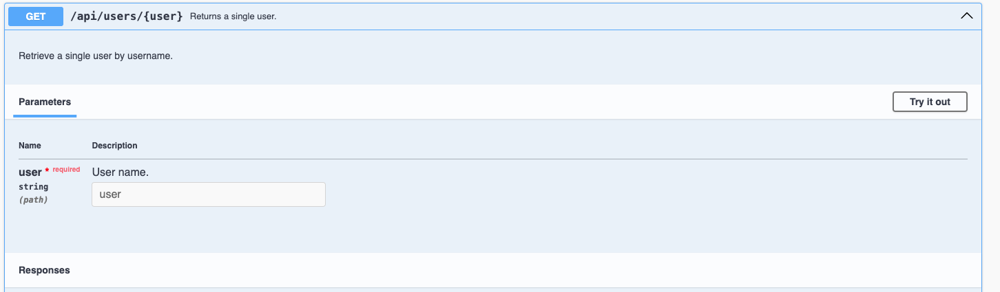

# **Node JS Express for FrontEnd Developers Part Eight: Documenting the API with Swagger**

In [Part Seven](https://www.linkedin.com/pulse/node-js-express-frontend-developers-part-seven-testing-jonathan-gold-cpyif/) of this series, we investigated two testing approaches. The first approach used Postman as an HTTP client application to send data to individual routes. The second approach used the Jest and Supertest frameworks to write automated test scripts. Now we have a fully functional Task Management API that receives data and is able to query, persist, and modify that data using a database. We also have a complete test suite that tests all available API routes. All we are missing is documentation that demonstrates our API and shows us how to use it. In the final installment in this series, we will use Swagger to document our code. 

[Swagger](https://swagger.io/) is a set of tools for designing, building, and documenting APIs. Swagger automatically generates interactive, user-friendly documentation for APIs, making it easier for developers to understand and test API endpoints. We will use swagger to generate a web page that displays all the Task API routes, organized by type (users, tasks), and lets you run sample code.

As with previous installments, the sample code and files for this installment can be downloaded from [GitHub](https://github.com/trider/node-task-api-tutorial/tree/main/node-task-api-part-02).

## **Installing Swagger**

Installing Swagger involves installing two NPM packages. First, you install Swagger Jsdoc. This package reads Swagger annotated source code and generates a Swagger specification. To install the package, type the following in your IDE’s integrated terminal:

```bash
npm i swagger-jsdoc
```

The second package is Swagger UI Express. This package allows you to serve auto-generated swagger-ui generated API docs from express, based on a swagger.json file. The result is a web page that acts as live documentation for your API hosted from your API server via a route. To install the package, type the following in your IDE’s integrated terminal:

```bash
npm i swagger-ui-express
```

## **Configuring Swagger**

Open index.js. At the top of the file, declare a variable that references Swagger UI Express.

```javascript
const swaggerUi = require('swagger-ui-express');
```

Next, declare a variable that references Swagger Jsdoc

```javascript
const swaggerJsdoc = require('swagger-jsdoc');
```

Following the variables, declare the Swagger options. These include the openapi version, descriptive information, servers, and referenced API files.

```javascript
const swaggerOptions = {
 definition: {
   openapi: '3.0.0',
   info: {
     title: 'User API',
     version: '1.0.0',
     description: 'API for managing user tasks',
   },
   servers: [
     {
       url: 'http://localhost:3000',
     },
   ],
 },
 apis: [
   './api/api.js',
   './api/modules/users.js',
   './api/modules/tasks.js'
  ],
};
```

Next, we declare a variable that consumes the Swagger options.

```javascript
const swaggerSpec = swaggerJsdoc(swaggerOptions);
```

Now, we create the Swagger middleware.

```javascript
app.use('/api-docs', swaggerUi.serve, swaggerUi.setup(swaggerSpec));
```

The last step is to create a redirect that on opening the default url ([http://localhost:3000](http://localhost:3000)) redirects the browser to the Swagger Page. Relaunch the API, and the following is displayed.


## **Annotating Code**

Now we have everything in place, we can annotate our code. We will start by opening api/modules/users.js. At the top of the file, following the variable declarations we will add component code. First, we declare a user object component. This object provides a basic example that will be reused in all our annotated routes. Depending on the data structure returned by a route and displayed in the example, the user object will be displayed as an object or as part of an array. Each annotation is formatted using [YAML](https://yaml.org/) notation.

```javascript
/**
* @swagger
* components:
*   schemas:
*     User:
*      type: object
*      properties:
*       _id:
*        type: string
*        description: Unique ID of task.
*        example: 6630ab326e723ac1ea6dce7a
*       email:
*        type: string
*        description: The user's email address.
*        example: jg@mail.com
*       name:
*        type: string
*        description: User's first and last names.
*        example: Joe Green
*       password:
*        type: string
*        description: User's password.
*        example: password
*       userName:
*        type: string
*        description: The user's name.
*        example: joegreen
*       userId:
*        type: integer
*        description: The user ID.
*        example: 1
*       isActive:
*        type: boolean
*        description: The user's status.
*        example: true
*       created:
*        type: string
*        description: The date the user was created.  
*        example: 2021-09-23T00:00:00.000Z
*       updated:
*        type: string
*        description: The date the user was last updated.
*        example: 2021-09-23T00:00:00.000Z
*      -ref: '#/components/schemas/User' 
*/
```

The annotation starts with a list of components and schemas for each component. This is followed by a list of properties. Each property starts with its name, data type (type), description, and an example.

Next we annotate the first route in the file. Following the component object, add the following annotation:

```javascript
/**
* @swagger
* /api/users:
*   get:
*     summary: Retrieve a list of users.
*     description: Retrieve a list of users from the database.
*     tags:
*      - Users
*     responses:
*       200:
*         description: A list of users.
*         content:
*           application/json:
*             schema:
*               type: array
*               items:
*                 type: object
*                 $ref: '#/components/schemas/User'
*/
```

The annotation starts with the route. Next, it declares the HTTP command the annotated route uses (GET). Immediately after this, is a summary, description, and tags. The tags section indicates the section in which the route is displayed. The last section describes the response and ends in a reference to the user annotation. If you refresh your browser, the following is displayed.


Our second annotation is for the GET /api/users/:users route. This is almost identical to the previous annotation, but is formatted to handle a parameterized URL. It includes a section that describes the parameter the URL uses.

```javascript
/**
* **
* @swagger
* /api/users/{user}:
*   get:
*     summary: Returns a single user.
*     description: Retrieve a single user by username.
*     tags:
*     - Users
*     parameters:
*     - in: path
*       name: user
*       required: true
*       description: User name.
*       schema:
*         type: string
*     responses:
*       200:
*         description: A user profile.
*         content:
*          application/json:
*            schema:
*              $ref: '#/components/schemas/User'
*/
```

Refreshing the browser will display an additional section for this route. The section also includes a text box for entering the user parameter.



Finally we will annotate the POST /api/users/login route. This annotation includes a section that describes the route’s payload (requestBody).

```javascript
/**
* **
* @swagger
* /api/users/login:
*   post:
*     summary: Login a user.
*     tags:
*      - Authentication
*     description: Login a user by username and password.
*     requestBody:
*       required: true
*       content:
*         application/json:
*           schema:
*             type: object
*             properties:
*               email:
*                 type: string
*                 description: The user's email address.
*                 example: jonnygold@gmail.com
*               password:
*                 type: string
*                 description: The user's password.
*                 example: 1234
*     responses:
*       200:
*         description: A user profile.
*         schema:
*           $ref: '#/components/schemas/User' 
* 
*/
```

Refreshing the browser displays the annotated route and creates a request body section. It also populates each field in the request body.


After annotating the user routes, we can annotate the task routes. Open the tasks.js, and add a task annotation component.

```javascript
**
* @swagger
* components:
*  schemas:
*    Task:
*     type: object
*     properties:
*      _id: 
*       type: string
*       description: Unique ID of task.
*       example: 6630ab326e723ac1ea6dce7a
*      description:
*        type: string
*        description: The task description.
*        example: Task description
*      name:
*        type: string
*        description: The task name.
*        example: Task name
*      taskId:
*        type: integer
*        description: The task ID.
*        example: 1
*      user:
*        type: string
*        description: The user name.
*        example: joegreen
*      added:
*        type: string
*        description: The date the task was added. 
*        example: 2021-09-23T00:00:00.000Z
*      updated:
*        type: string
*        description: The date the task was last updated.
*        example: 2021-09-23T00:00:00.000Z
*      status:
*        type: string
*        description: The task status.
*        example: do
*      isActive:
*        type: boolean
*        description: The task is in use.
*        example: true
*
*/
```

Annotate each route with the following annotations.

```javascript
/**
*
* @swagger
*  /api/tasks/user/{user}:
*    get:
*     summary: Retrieve a list of tasks for a user.
*     description: Retrieve a list of tasks for a user from the database.
*     tags:
*     - Tasks
*     parameters:
*     - in: path
*       name: user
*       required: true
*       description: The user name
*       schema:
*        type: string
*     responses:
*      200:
*       description: A list of tasks for the user.
*       content:
*        application/json:
*         schema:
*          type: array
*          items:
*           type: object 
*           $ref: '#/components/schemas/Task'
*/


router.get('/user/:user',  (req, res) =>{...});


/**
* @swagger
* /api/tasks/task/{id}:
*   get:
*     summary: Returns a single task.
*     description: Retrieve a single task by task ID.
*     tags:
*     - Tasks
*     parameters:
*     - in: path
*       name: id
*       required: true
*       description: Task ID.
*       schema:
*         type: integer
*     responses:
*       200:
*         description: A task.
*         content:
*          application/json:
*            schema:
*              $ref: '#/components/schemas/Task'
*/
router.get('/task/:taskId',  (req, res) =>{...});


/**
* @swagger
* /api/tasks/add:
*   post:
*     summary: Create a new task.
*     description: Create a new task in the database.
*     tags:
*     - Tasks
*     requestBody:
*       required: true
*       content:
*         application/json:
*           schema:
*            type: object
*            properties:
*              name:
*                type: string
*                description: The task name.
*                example: A New Task
*              description:
*                type: string
*                description: The task description.
*                example: A new task description
*              user:
*                type: string
*                description: The user name.
*                example: jonnygold
*     responses:
*       200:
*         description: A new task.
*         schema:
*           $ref: '#/components/schemas/Task'
*/


router.post('/add', (req, res) => {...});


/**
* @swagger
* /api/tasks/update:
*   post:
*    summary: Update a task.
*    tags:
*    - Tasks
*        properties:
*          name:
*           type: string
*           description: The task name.
*           example: A New Task 
*          description:
*           type: string
*           description: The task description.
*           example: A new task description
*          user:
*           type: string
*           description: The user name. 
*           example: jonnygold
*          taskId:
*            type: integer
*            description: The task ID.
*            example: 1
*          status:
*            type: string 
*            description: The task status.
*            example: do
*    responses:
*        200:
*          description: A task.
*          schema:
*            $ref: '#/components/schemas/Task'
*/
router.post('/update/:taskId', (req, res) => {...});


/**
* @swagger
* /api/tasks/delete:
*  post:
*   summary: Delete a task.
*   description: Delete a task in the database.
*   tags:
*    - Tasks
*   requestBody:
*     required: true
*     content:
*       application/json:
*          schema:
*           type: object
*           properties:
*              taskId:
*                type: integer
*                description: The task ID.
*                example: 1
*   responses:
*    200:
*     description: A task.
*     schema:
*      $ref: '#/components/schemas/Task'
*/
router.post('/delete', (req, res) => {...});
```

Refresh the browser, and the fully annotated API is displayed.


## **Conclusion**

In this installment, we documented our API with Swagger. Now, we have a full Task API, with a complete test suite, and documentation. This should serve as a good basis for building your own NodeJS and Express Framework APIs. You can also use it as a backend for any frontend projects. I want to thank everyone who has viewed, responded, or commented on each article. I have ideas for future tutorial series and hope to launch at least one in the near future.
